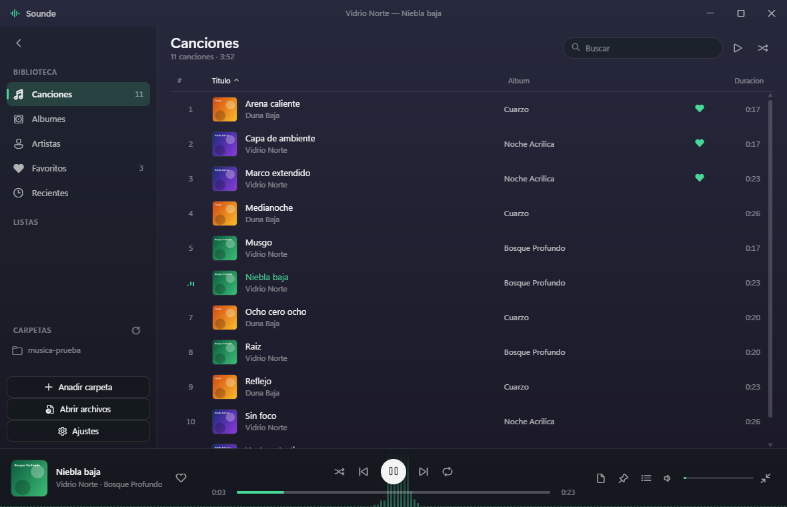

# Sounde

Reproductor de audio para Windows 11, con acrílico de verdad y el color sacado
de la carátula que suena.



---

## Lo que hace

**Reproducción.** Dos decks de audio que se turnan, así que el cambio de
canción no tiene hueco y el fundido cruzado (0–12 s) es real, no un corte
disimulado. Ecualizador de diez bandas con ocho presets y preamplificación,
normalización por ReplayGain, velocidad de 0.5× a 2× sin cambiar el tono, y un
limitador de seguridad que evita que un ReplayGain generoso más una subida de
graves acaben recortando en la tarjeta.

**Biblioteca.** Escaneo incremental de tus carpetas: solo se reparsea lo que
cambió de fecha o de tamaño, así que sobre una biblioteca ya vista el arranque
cuesta milisegundos. Canciones, álbumes, artistas, favoritos, recientes y
listas de reproducción, con importación y exportación en `.m3u`.

**Spotify.** Conectas la cuenta y tus listas y tus me gusta aparecen junto a
la música local, con una cuenta al lado de cada una: cuántas de esas canciones
ya tienes en el disco. Las que tienes suenan por el motor de siempre, con
ecualizador, fundido y visualizador. Las que no, se ven igual pero apagadas.
Más abajo está [por qué no reproduce de Spotify](#lo-que-no-hace-y-por-qué).

**Letras.** Un `.lrc` al lado del archivo o las etiquetas del propio archivo.
Si llevan tiempos, la línea que suena se resalta y pulsándola se salta ahí.

**Windows.** Teclas multimedia por sesión de medios (la ficha con carátula que
sale al pulsarlas es la de Sounde), botones sobre la miniatura de la barra de
tareas, barra de progreso y distintivo sobre el icono, aviso al cambiar de
canción, bandeja, y mini-player siempre encima.

**Manejo.** Paleta de comandos con `Ctrl+K` que busca a la vez acciones y
música, atajos para todo, temporizador de apagado con fundido, y panel de
ajustes que expone todo lo anterior.

## Instalar

Está en [INSTALAR.md](INSTALAR.md), incluido por qué el último clic para
ponerlo por defecto lo tienes que dar tú (resumen: Windows no deja hacerlo por
código, y hace bien).

```powershell
npm ci
npm run icono   # dibuja build/icon.ico desde el codigo
npm run dist    # instalador en dist/
```

Para trastear sin instalar nada: `npm start`.

---

## Spotify: catálogo sí, audio no

### Lo que no hace, y por qué

**Sounde no reproduce audio de Spotify.** No es que falte por hacer: es una
decisión, y esta es la razón.

Reproducir una pista de Spotify obliga a pasar por el Web Playback SDK, que
va cifrado con DRM. Y **el audio bajo EME no se puede meter en
`createMediaElementSource`**: Chromium no deja tocar esas muestras. Una
canción de Spotify sonaría sin ecualizador, sin fundido cruzado, sin
ReplayGain, sin control de velocidad y con el visualizador plano. Es decir,
sin nada de [el grafo de audio](#el-grafo-de-audio), que es la mitad de este
programa. Habría dos reproductores con dos comportamientos distintos dentro
de la misma ventana, y el usuario no tendría forma de saber cuál le va a
tocar hasta pulsar.

Tampoco descarga nada. Lo que baja Spotify al "descargar" queda cifrado en la
caché de su propio cliente y no hay API que lo exponga; sacarlo de ahí es
romper el DRM. Con YouTube pasa parecido por otro camino: se puede leer una
lista, pero bajar el audio va contra sus términos, así que ese descargador no
está aquí.

Lo que sí resuelve, que es el problema de verdad: **saber qué te falta.** Una
lista de Spotify entra, se cruza con tu disco, y te dice qué tienes y qué no.
Lo que falta lo consigues por donde tú decidas, y en cuanto el archivo cae en
una carpeta vigilada la lista se completa sola.

### Hace falta Premium, y no por lo que parece

Desde **febrero de 2026** Spotify exige que la cuenta que **registra la app de
desarrollador** tenga Premium. Una cuenta gratuita ya no puede crear una, así
que sin Premium esta parte de Sounde no se puede usar. No es cosa nuestra ni
tiene nada que ver con reproducir: es el requisito para tener un Client ID.

Del mismo cambio salen otros tres límites que conviene saber:

- Un solo Client ID en modo desarrollo por cuenta.
- Hasta cinco usuarios autorizados por aplicación. Para uso propio sobra.
- **Solo se pueden leer las canciones de tus listas y de aquellas en las que
  colaboras.** Las que solo sigues devuelven `403`, así que aparecen en la
  barra lateral pero entran vacías y marcadas. Sounde no aborta por eso: una
  cuenta normal tiene listas seguidas, y si un `403` tumbara la
  sincronización, la función no le serviría a casi nadie.

### Cómo se conecta

Hace falta un Client ID tuyo, del panel de Spotify, y no viene ninguno puesto.
En PKCE el Client ID viaja en la URL a la vista de cualquiera, así que
repartir uno en el instalador significaría que todas las instalaciones
comparten la misma cuota de la API: con unos cuantos sincronizando a la vez,
a los demás les empieza a salir `429`. Con el tuyo, tienes la tuya.

En Ajustes → Spotify está la URI de retorno que hay que registrar allí, con
un botón para copiarla. Es `http://127.0.0.1:8888/callback`, con la IP
escrita y no `localhost`, porque Spotify ya no admite el nombre.

La autorización se abre en **el navegador del sistema**, no en una ventana de
Electron. Meterla dentro sería pedirte que escribas la contraseña de Spotify
en una ventana dibujada por esta aplicación, sin barra de direcciones que
diga si el sitio es el de verdad y sin que funcione tu gestor de contraseñas.
Aunque aquí nadie toque nada, esa es exactamente la costumbre que aprovecha
el phishing.

El token de refresco se guarda cifrado con DPAPI, en su propio archivo y no
en `settings.json`, que se lee en claro y está pensado para editarlo a mano.
Si el cifrado no está disponible no se guarda nada: es mejor volver a
conectar en cada arranque que dejar una credencial de larga vida en el disco.

### Emparejar sin mentir

Los dos errores posibles se ven en pantalla y no cuestan lo mismo. Un falso
positivo hace que al pulsar suene otra canción; un falso negativo te manda a
buscar algo que ya tenías. El segundo se arregla solo en cuanto lo miras, así
que **ante la duda no se empareja.**

Se quitan las coletillas de catálogo (`- Remastered 2011`, `(feat. X)`) y se
conservan a propósito `(Live)`, `(Remix)` y `(Acoustic)`: son grabaciones
distintas, no la misma con otro nombre. Y una duración fuera de margen
descarta en vez de restar puntos — mismo título y mismo artista con dos
minutos de diferencia no es una etiqueta mal puesta, es otra grabación.

En la lista se distingue la coincidencia exacta de la hecha por parecido. Ese
enlace lo hicimos nosotros comparando texto, así que si algún día suena algo
que no toca, ahí es donde se mira para entender por qué.

### Lo que no sale de aquí

Todas las peticiones a Spotify salen del **proceso principal**. La página
tiene una CSP con `default-src 'none'` y sin `connect-src`; si las llamadas
salieran del renderer habría que abrirle un agujero a `api.spotify.com`, y ese
agujero vale para cualquier cosa que llegue a ejecutarse ahí dentro.

Por lo mismo, las carátulas de Spotify se descargan a la caché y se sirven por
`sounde-art://` en vez de pintar la URL de `i.scdn.co`: así la CSP se queda
intacta y además se siguen viendo sin conexión.

---

## El vidrio: dos capas que se suman

Esto es lo que confunde a todo el mundo que toca el tema, incluido yo al
empezar, así que va primero.

**`backdrop-filter` NO puede difuminar el escritorio.** Solo muestrea píxeles
que ya están dentro de la página. Lo que hay detrás de la ventana no existe
para el CSS.

El desenfoque de verdad lo pone **DWM**, el compositor de Windows, sobre la
ventana entera. La ventana se declara con `backgroundColor: '#00000000'` y
`backgroundMaterial: 'acrylic'`, y a partir de ahí el trabajo del CSS es
justamente **no pintar opaco**.

De ahí salen dos capas distintas que se suman, y saber cuál estás moviendo es
la diferencia entre arreglar el vidrio y empeorarlo:

| | Dónde vive | Qué hace | Se toca en |
|---|---|---|---|
| **Capa de DWM** | Detrás de la página | Difumina el escritorio y lo mezcla con un tinte | Ajustes → Vidrio, y `backdropAlpha` |
| **Capa del CSS** | Encima, la pinta la página | Vela lo difuminado para que el texto se lea | Ajustes → Veladura, o `--transparencia` |

**Si el vidrio se ve turbio, casi siempre sobra de la de CSS, no de la de
Windows.**

En `src/renderer/styles/acrylic.css` hay tres perillas y todo lo demás se
deriva de ellas: `--transparencia`, `--tinte` y `--acento`.

`backdrop-filter` sí se usa en esta aplicación, pero solo en menús, diálogos,
la paleta y los globos: ahí sí hay píxeles de la propia interfaz debajo que
difuminar.

### Modos de vidrio

| Modo | Qué es |
|---|---|
| `acrylic` | El del sistema. Windows lo apaga solo al perder el foco: es su comportamiento, no un fallo. La interfaz lo compensa subiendo su propia veladura. |
| `acrylic-always` | Acrílico por `SetWindowCompositionAttribute`. Sigue difuminado sin foco. |
| `mica` / `tabbed` | Tiñen el fondo y difuminan menos. |
| `none` | Sin backdrop del sistema. Lo más ligero. |

### El color adaptativo

El tinte y el acento salen de la carátula: se cuenta un histograma de la
imagen, se descarta lo gris y lo casi negro, y el tono dominante cruza al
siguiente por el camino corto de la rueda de color.

Hay una regla que hay que respetar y está anotada en el CSS: **nada que derive
de `--acento` o `--tinte` puede llevar `transition`**. El bucle de animación
reescribe esas variables en cada fotograma, así que una transición CSS encima
se reinicia sesenta veces por segundo y nunca converge. El síntoma es de los
que se buscan una tarde: el logo y la barra de progreso siguen pintando el
color del álbum anterior mientras la variable ya tiene el nuevo.

---

## Atajos

| | |
|---|---|
| `Espacio` | Reproducir / pausar |
| `Ctrl` `←` `→` | Canción anterior / siguiente |
| `←` `→` | Retroceder / adelantar 5 s |
| `↑` `↓` | Volumen |
| `M` · `S` · `R` · `F` | Silencio · aleatorio · repetición · favorito |
| `Ctrl+1..5` | Canciones, Álbumes, Artistas, Favoritos, Recientes |
| `Ctrl+L` | Letra |
| `Ctrl+F` | Buscar |
| `Ctrl+Q` | Cola |
| `Ctrl+B` | Plegar el panel lateral |
| `Ctrl+M` | Mini-player |
| `Ctrl+,` | Ajustes |
| `Ctrl+K` | Paleta de comandos |

Con el foco en un campo de texto, las teclas sueltas son del campo. Las que
llevan `Ctrl` funcionan igual: `Ctrl+F` tiene que valer aunque ya estés en el
buscador.

---

## Cómo está montado

```
src/main/         proceso principal
  main.js         arranque, instancia unica, "Abrir con"
  window.js       la ventana acrilica y el mini-player
  protocols.js    los tres esquemas propios
  library.js      escaneo y metadatos
  collections.js  favoritos, historial y listas
  letras.js       .lrc y etiquetas
  taskbar.js      miniatura, progreso y distintivo
  bandeja.js      icono de la bandeja
  iconos.js       los iconos, dibujados
  ipc.js          todos los handlers
  preload.js      el unico puente con la pagina

src/main/spotify/ el catalogo remoto
  index.js        la unica cara hacia el resto de la app
  auth.js         OAuth PKCE y el servidor de retorno
  api.js          Web API: reintentos, 429 y paginacion
  catalogo.js     traer listas, guardadas y caratulas
  emparejar.js    cruce con la biblioteca local
  credenciales.js el token cifrado

src/renderer/     la pagina
  js/player.js    motor de audio (Web Audio)
  js/queue.js     cola, aleatorio y repeticion
  js/shell.js     navegacion y vistas
  js/spotify.js   la vista del catalogo
  ...
```

### Tres esquemas propios

- `sounde://app/…` — la interfaz. Hace falta un esquema estándar porque sobre
  `file://` Chromium bloquea los módulos ES por CORS.
- `sounde-file://local/…` — el audio del disco, con rangos HTTP para que
  arrastrar la barra no descargue el archivo entero.
- `sounde-art://cache/…` — las carátulas ya extraídas.

Las rutas viajan en base64url: una ruta de Windows lleva `C:`, barras
invertidas y a veces `#`, y no cabe limpia en una URL.

### Seguridad

`contextIsolation`, `sandbox`, sin `nodeIntegration`, y una CSP estricta **sin
`'unsafe-inline'`**. Por eso en todo el código no hay ni un atributo `style=""`
ni un `<style>` suelto: lo dinámico se hace por CSSOM, que la CSP sí permite.

Los esquemas propios no sirven cualquier ruta del disco: solo lo que esté bajo
una carpeta autorizada o sea un archivo abierto a propósito.

### El grafo de audio

```
<audio> → source → trackGain → fadeGain ─┐
                                          ├→ preamp → EQ ×10 →
<audio> → source → trackGain → fadeGain ─┘

  → limitador → analizador → master → salida
```

`trackGain` y `fadeGain` van separados a propósito: el primero lleva la
normalización de la pista y el segundo el fundido. Si fueran el mismo nodo,
cada fundido borraría la normalización.

El analizador está **antes** del master, así que el visualizador dibuja la
señal de la música y no la del mando de volumen: bajar el volumen no debe
aplastar las barras hasta dejarlas planas.

---

## Cómo se ha verificado

Cada pieza lleva su comprobación por código, y las que se ven se han mirado en
capturas de la ventana real. No es decoración del historial: la mitad de los
fallos de este repositorio los cazó una prueba y no una lectura.

Algunos ejemplos de lo que hizo falta medir en vez de suponer:

- El fundido cruzado se verificó muestreando el RMS por el analizador, no
  escuchándolo: se oía bien y estaba matando la pista entrante.
- El color adaptativo se verificó leyendo píxeles de una captura: la variable
  ya tenía el color nuevo mientras la pantalla seguía pintando el viejo.
- Las teclas multimedia se verificaron preguntándole a Windows por WinRT qué
  sesión de medios ve y mandándole órdenes desde el sistema hacia la
  aplicación, no al revés.
- El ecualizador vertical se verificó mirando dónde caen los pomos en la
  imagen: en la primera versión estaban los diez a la misma altura mientras
  las etiquetas decían de +6 a −9, y todas las comprobaciones de valores
  pasaban.
- El PKCE se verificó comprobando que el verificador que se manda al canjear
  es el que corresponde al reto que salió en la URL. Que los campos estén
  puestos no prueba nada; que el `SHA-256` cuadre, sí.
- El orden de "atar el puerto" y "abrir el navegador" salió de una prueba con
  el puerto ocupado a propósito. Estaba al revés: el usuario concedía los
  permisos y aterrizaba en un puerto muerto, habiendo dado acceso a su cuenta
  a cambio de un error.
- La vista del catálogo se verificó cargando la interfaz de verdad en una
  ventana y midiendo la geometría, no solo el DOM. Y la primera captura
  mentía: una ventana con `show: false` no compone, así que devolvía un
  fotograma viejo mientras el DOM ya tenía la vista nueva.

---

## Licencia

MIT.
